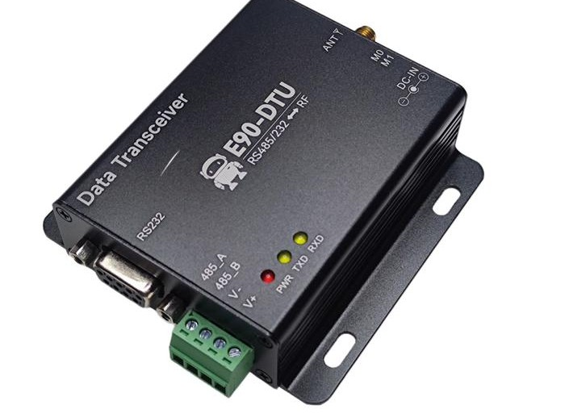
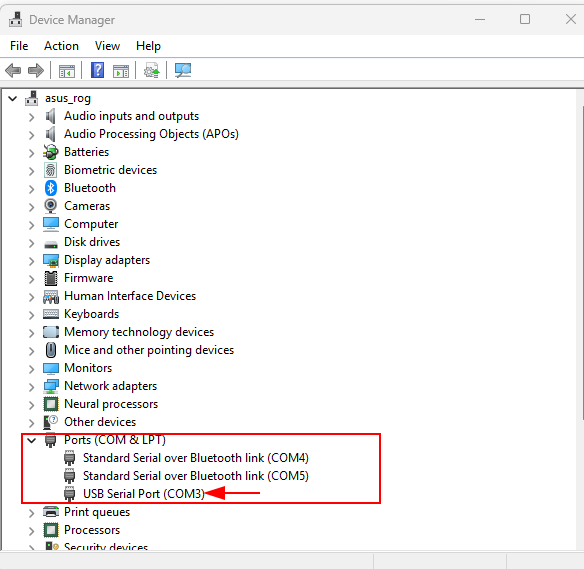
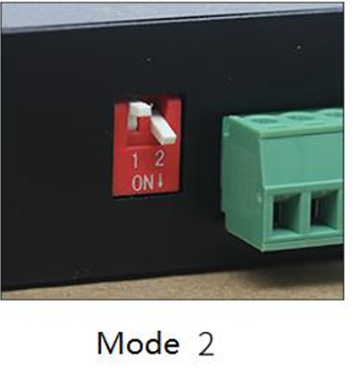
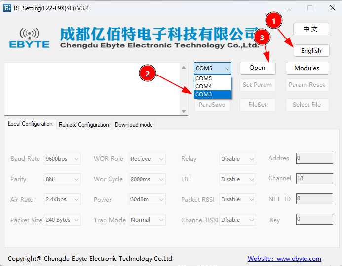
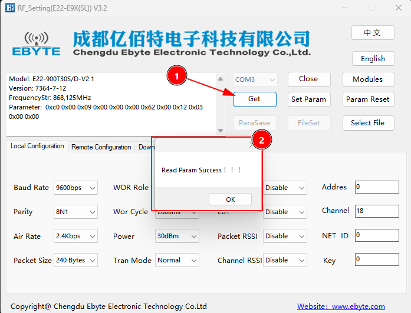
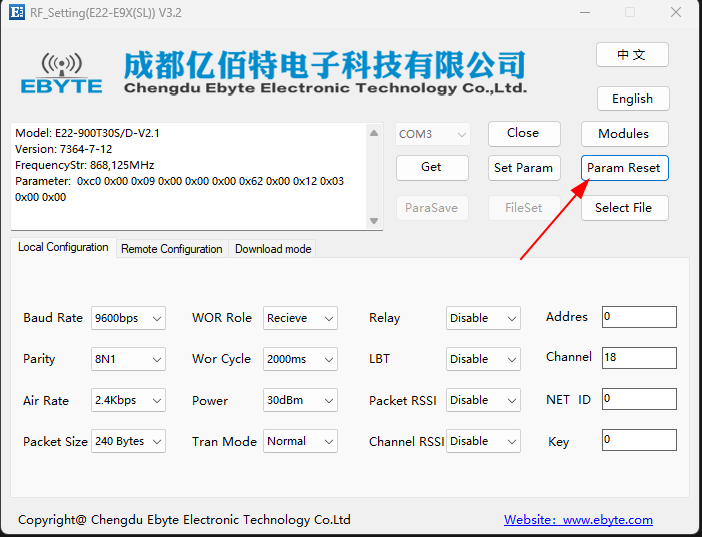
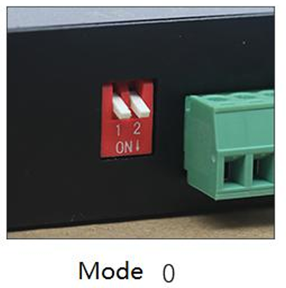

# EBYTE E90-DTU (900SL30) RS232 RS485

E90-DTU (900SL30) adalah transceiver data canggih yang menggunakan teknologi modulasi LoRa tingkat militer. Cocok untuk berbagai kebutuhan komunikasi data, perangkat ini beroperasi di pita frekuensi 850.125~930.125 MHz.

Antarmuka RS232/RS485 Transparan dengan dukungan input tegangan 8-28VDC memastikan konektivitas yang mudah dan fleksibel.

**Spesifikasi Lengkap:**

- Frekuensi Kerja: 850.125~930.125 MHz
- Daya Transmisi: 30 dBm (sekitar 1W)
- Kecepatan Data Udara: 0.3k~62.5kbps (Default: 2.4kbps)
- Jenis Antena: SMA-K
- Antarmuka Komunikasi: RS232 / RS485
- Jumlah Channel: 81
- Sumber Daya: 8-28VDC (direkomendasikan 12V atau 24V)
- Arus Transmisi: 45mA pada 30dBm (1W)

## Software

- Configuration Tool

  - https://github.com/hwthinker/-EBYTE-E90-DTU-900SL30/blob/main/software/RF_Setting(E22-E9X(SL))%20V3.2.7z
- atau https://icedrive.net/s/573kCN6XxAjStGNY7va9CG4ikT1R

## Manual 

- https://github.com/hwthinker/-EBYTE-E90-DTU-900SL30/blob/main/PDF/E90-DTU(900SL30)_UserManual_EN_v1.2.pdf
- atau https://icedrive.net/s/XTY7YaSXRTbiZ8zhNz7jVbQVDDPz

## Cara konfigurasi

- pasang dulu usb serial  dan cek di device manage untuk mengetahui COM nomor berapa

- Ubah Konfigurasi dipSwitch dan pastikan pastikan modenya adalah mod e2

- Jalankan RFsetting dan ubah bahasanya ke bahasa inggris, kemudian pilih Serial Port yang sesuai dan kemudian pilih open

- Klik Get bila berhasil hasilnya akan seperti ini

- Bila menginginkan mereset parameter bawaan pabrik Pilh Param Reset Terlebih dahulu

- BIla sudah Selesai Melakukan Konfigurasi Pastikan kembalikan Lagi dip Switch Ke Mode Normal agar Lora bisa saling Berkomunikasi dengan Device yang Sejenis

> [!NOTE]
>
> - Device ini saling berkomunikasi dengan device lain hanya ketika menggunakan mode normal (mode 0)
> - Untuk Melakukan Konfigurasi Ubah terlebih dahulu modenya menjadi Mode 2, bila selesai pastikan kembalikan lagi ke Mode Normal (mode 0)
> - Software masih dalam keadaan terkompresi, pastikan mengetrak file mengguanakan  software 7zip yang bisa didownload di https://7-zip.org/download.html